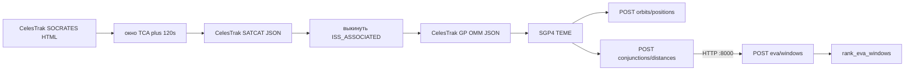

# CosmoHACK — контекст для агента (4-й endpoint: погода + ML)

Документ для быстрого погружения. Читать сверху вниз. Код орбит **не переписывать**, если задача — погода/ML.

Репозиторий: `CosmoHACK/`. Два HTTP-сервиса:

- **Orbit API** — `CosmoHACK/MMOD/main.py`, порт **8000** (`/health`, `/api/v1/orbits/positions`, `/api/v1/conjunctions/distances`).
- **EVA API** — `CosmoHACK/merge_time_sections/app.py`, порт **8001** (`/health`, `/api/v1/eva/windows`).

OpenAPI-спека (ручная, общая): `CosmoHACK/openapi (2).yaml`.  
Swagger орбит: `http://localhost:8000/docs`. Swagger EVA: `http://localhost:8001/docs`.

---

## 1. Что это за продукт

Хакатонный backend планирования **ВКД (EVA) на МКС**.

Пользователь задаёт горизонт (до 24 ч) и длительность выхода. Система:

1. Берёт кандидатов сближения МКС из CelesTrak **SOCRATES**.
2. Распространяет орбиты **SGP4** (TEME, км / км/с).
3. Считает дистанции МКС ↔ внешние объекты.
4. Предлагает окна ВКД: сначала полностью безопасные, иначе слоты с риском и предупреждением.

Погода и ML **ещё не подключены**. Третий endpoint уже умеет ранжировать окна по орбите и оставляет крючки под погодный коэффициент. Четвёртый endpoint должен дать этот коэффициент (и сырые индексы), не ломая первые три.

**Не путать:** порог `critical_distance_km` (обычно 5 км) — порог **скрининга** SOCRATES, не вероятность столкновения и не радиус станции. Относительные скорости LEO ~10–15 км/с.

---

## 2. Как запустить

```bash
cd CosmoHACK/MMOD
pip install -r requirements.txt
uvicorn main:app --host 0.0.0.0 --port 8000

# другой терминал
cd CosmoHACK
pip install -r merge_time_sections/requirements.txt
uvicorn merge_time_sections.app:app --host 0.0.0.0 --port 8001
```

После правок `main.py` нужен **рестарт** uvicorn (без `--reload`).

Зависимости орбит: `fastapi`, `uvicorn`, `httpx`, `numpy`, `requests`, `beautifulsoup4`, плюс `sgp4` (ставится транзитивно через skyfield).  
Погодный агрегатор: `CosmoHACK/data_agregate/requirements.txt` (`netCDF4`, `numpy`, `cftime`, `requests`).

---

## 3. Карта репозитория

| Путь | Зачем |
|---|---|
| `MMOD/main.py` | FastAPI Orbit API: health, positions, distances. Кеши, SGP4, SATCAT. |
| `MMOD/get_data.py` | Скрапинг SOCRATES HTML. Fallback `celestrak.org` → `celestrak.com`. |
| `MMOD/iss_conjunctions.json` | Локальный дамп SOCRATES, если CelesTrak/DNS недоступен. |
| `openapi (2).yaml` | Контракт схем. Обновлять вместе с Pydantic-моделями. |
| `merge_time_sections/app.py` | FastAPI EVA API: `/api/v1/eva/windows`. Ходит в MMOD по HTTP. |
| `merge_time_sections/rank.py` | Ранжирование окон ВКД. Сюда вставлять `weather_danger`. |
| `merge_time_sections/clients.py` | HTTP-клиенты: `GET /space-weather`, `POST /conjunctions/distances`. |
| `merge_time_sections/fixtures/space_weather.json` | **Целевой JSON** погодного ответа для ранжирования. |
| `merge_time_sections/service.py` | CLI на моках. Не прод. |
| `data_agregate/fetch_space_weather.py` | Выгрузка GOES/SEISS + GFZ Hp30/ap30/Kp. |
| `data_agregate/output/space_weather.json` | Сырой дамп агрегатора (большой, без `eva_coefficient`). |
| `frontend/` | Глобус Three.js, читает `MMOD/trajectories.json`. К API почти не привязан. |

---

## 4. Жёсткие правила архитектуры

Сложились по ходу хакатона. Их ломать нельзя без явной просьбы:

1. **EVA-сервис не считает SGP4.** Он вызывает Orbit API `POST /api/v1/conjunctions/distances` по HTTP (`CONJUNCTION_API_BASE_URL`, default `:8000`). Погоду — отдельным сервисом, когда `WEATHER_ENABLED=1`.
2. **Не переписывать** `POST /api/v1/orbits/positions` и `POST /api/v1/conjunctions/distances` в MMOD.
3. **Нет Redis / БД / Celery / Docker-обязаловки / pytest-сюиты**, пока не попросили.
4. Кеш — **in-memory** процесса (TTL 2 ч для SOCRATES/OMM/SATCAT).
5. Окна ВКД **не сохранять**. Меняется только `duration_min` / `step_min` / `top_k` — орбиты не пересчитывать (кеш distances в EVA).
6. Не интерполировать неизвестные дистанции «как безопасные».
7. Не подставлять фиктивный нулевой погодный риск. Нет данных → `null` + warning, не `0`.
8. Не писать «окно безопасно», пока погода не учтена.
9. Ошибки API:

```json
{ "error": { "code": "VALIDATION_ERROR", "message": "...", "details": null } }
```

Коды: `VALIDATION_ERROR`, `PROPAGATION_ERROR`, `STALE_ORBITAL_ELEMENTS`, `ORBITAL_ELEMENTS_ERROR`, `SOURCE_UNAVAILABLE`, `ORBIT_SERVICE_ERROR`.

---

## 5. Существующие endpoint

Все времена: ISO-8601 с таймзоной, внутри UTC. Горизонт API: `(0, 24]` часа. Полуинтервал `[start_time, end_time)`.

### `GET /health`

`{ "status": "ok" }`.

### `POST /api/v1/orbits/positions`

Минутная сетка TEME: МКС (NORAD **25544**) + все **внешние** кандидаты SOCRATES, которых удалось распространить.

Тело: `{ "start_time", "end_time" }`.

`data_quality.status`: `COMPLETE` | `PARTIAL` | `NO_CANDIDATES`.

### `POST /api/v1/conjunctions/distances`

Та же орбитальная база, но ответ — дистанции.

Тело: `{ "start_time", "end_time", "critical_distance_km"? }`.  
`critical_distance_km` **опционален**. Если `> 5` — только warning (скрининг SOCRATES 5 км). Равенство порогу **не** критично (`d < threshold`).

На каждую минуту: ближайший внешний объект, `distance_km`, `relative_speed_km_s`, `is_critical`.  
Плюс `critical_intervals` (после уточнения 1 с), `summary`.

Реализация: `async def _compute_distances(...)` в `MMOD/main.py`. EVA-сервис вызывает этот endpoint по HTTP, не импортирует SGP4.

### `POST /api/v1/eva/windows`

Ранжирует слоты одинаковой длины `duration_min`.

```json
{
  "start_time": "2026-09-20T03:30:00Z",
  "end_time": "2026-09-20T05:30:00Z",
  "duration_min": 30,
  "step_min": 1,
  "top_k": 5,
  "critical_distance_km": 5.0
}
```

Отличия валидации от distances:

- `critical_distance_km` **обязателен**, `0 < x ≤ 5`
- `top_k ≥ 2` (default 5)
- `step_min > 0` (default **30**; для мелкой сетки передавать **1**)
- если стартов `range(0, n - duration + 1, step)` меньше двух → `422` с текстом про невозможность сравнить два окна

Сейчас в хендлере `merge_time_sections/app.py`:

```python
distance_bundle = await fetch_distances_async(...)  # Orbit API :8000
weather = {"records": []}                           # пока WEATHER_ENABLED=0
ranked = rank_eva_windows(bundle, d=duration_min, step_min=..., top_k=..., d_crit_km=...)
```

---

## 6. Поток данных орбит



**SOCRATES:** сближения МКС, сортировка TCA, до 1000 записей. Много строк может быть одним NORAD (Союз повторяется). Уникальные `other_norad`.

**Фильтр комплекса МКС:** SATCAT `ORBIT_TYPE=DOC` / `ORBIT_CENTER=25544`, плюс явный id `100057` (Soyuz-MS 29). Они **не** кандидаты столкновения.

**OMM:** `gp.php?CATNR=...&FORMAT=json` (не TLE: 6-значные NORAD на TLE дают 404). `sgp4.omm.initialize`. Параллель `Semaphore(5)`.

**Сетка:** шаг 60 с, `sample_count = ceil(duration/60)` в distances/positions. В `rank.py` горизонт `n = floor((end-start)/60)` минут; хвост &lt; 60 с в окна не входит.

**Уточнение TCA:** вокруг событий ±120 с, векторно 1 с. `critical_intervals` — непрерывные отрезки `d < threshold`. Пересечения разных объектов **объединяются** (union), секунды не суммируются дважды.

**Кеши `main.py`:**

| Кеш | Ключ / TTL | Заметка |
|---|---|---|
| `socrates_cache` | 2 ч | При ошибке — stale RAM, затем `iss_conjunctions.json` |
| `omm_cache` | 2 ч на NORAD | |
| `satcat_cache` | 2 ч | |
| `_distances_bundle_cache` | `(start, end, critical_km, snapshot_id)` | только EVA; snapshot = время SOCRATES + OMM `retrieved_at` |

CelesTrak: сначала `.org`, затем `.com` (один IP). DNS Windows `11001` уже ловили.

Типичные живые TCA (дамп): GAOFEN-8 `40701` 2026-09-20 04:36:52Z, дальше OBJECT F / SMDC / FLOCK на других сутках.

---

## 7. Как ранжируются окна (`rank.py`)

Минутная сетка. Для минуты `i`:

- `distance[i]`, `known[i]` — без интерполяции
- `critical_seconds[i]` ∈ 0..60
- `distance_safety`: 0 если `d < critical`; 1 если `d ≥ 10` (`DISTANCE_ATTENTION_KM`); иначе линейно
- `debris_danger = 1 - safety`
- если `critical_seconds > 0` → danger 1, `debris_blocked`
- `weather_danger` / `weather_blocked` — **зарезервированы, сейчас всегда None / False**
- `combined_danger = max(debris, weather)` через `_combine_danger` (None игнорируется)
- `blocked = debris_blocked or weather_blocked`

`NO_CANDIDATES`: все минуты `known=True`, `danger=0`, плюс explanation. Это не абсолютная безопасность.

**Этап 1.** Безопасная минута: `known and critical_seconds==0 and danger==0`. Непрерывные зоны. В зону кладутся слоты длины ровно `duration_min` со стартом `origin + k * step_min`. Длину не ужимают.

Если SAFE ≥ `top_k`: разные зоны → непересекающиеся → больший запас до края зоны → более ранний start.

**Этап 2.** Все слоты той же длины. Префиксные суммы + две deque (peak danger, min distance), O(N). Статусы:

| status | когда |
|---|---|
| `INSUFFICIENT_DATA` | `data_coverage < 1` (приоритетнее всех) |
| `REQUIRES_REVIEW` | полные данные и `critical_overlap_seconds > 0` |
| `CAUTION` | overlap 0, но `peak_danger > 0` (зона 5–10 км или погода, когда появится) |
| `SAFE` | overlap 0 и `peak_danger == 0` |

Для фронта: `danger = peak_danger`, `safety = 1 - peak`. Если coverage 0 — оба `null`.  
`eva_min` в ответе **всегда `null`**, пока погода не подключена.

`reasons` / `factors` (`DEBRIS_PROXIMITY`) собираются из фактов. Смена `duration_min` — **новый план**, не «улучшение» того же.

---

## 8. Что уже готово под погоду (важно для 4-го endpoint)

### 8.1 Контракт, который ждёт ранжирование

Фикстура `merge_time_sections/fixtures/space_weather.json`:

```json
{
  "start": "2026-09-18T10:00:00Z",
  "end": "2026-09-18T10:10:00Z",
  "interval_minutes": 30,
  "eva_coefficient": 0.917,
  "records": [
    {
      "time": "2026-09-18T10:00:00Z",
      "eva_coefficient": 0.917,
      "parameters": {
        "gfz_Hp30": 1.667,
        "gfz_Kp": null,
        "gfz_ap30": 6.0,
        "swpc_mpsh_integral_electrons_g19_0_ge2_MeV": 334.9,
        "swpc_sgps_integral_protons_g19_0_ge10_MeV": 0.229
      }
    }
  ]
}
```

`eva_coefficient` ∈ **[0, 1]**, смысл как **safety** (1 = благоприятно для ВКД), не danger.  
`_hold_eva()` уже размазывает `records[].eva_coefficient` по минутам: значение держится до следующего record (каденс 30 мин → 30 минутных ячеек).

Сейчас результат `eva` **не идёт** в `weather_danger` и не попадает в `eva_min` ответа. Точки вставки в `build_minute_grid()`:

```python
eva = _hold_eva(weather.get("records") or [], origin, n)
# сейчас:
weather_danger[i] = None
weather_blocked[i] = False
# нужно:
# weather_danger[i] = 1 - eva[i]   если eva[i] is not None
# weather_blocked[i] = <жёсткий запрет по порогу ML, если будет>
```

И в `_public_window`: `eva_min` = минимум известных `eva` по минутам слота.

`_combine_danger(debris, weather)` уже делает `max`, то есть худший фактор побеждает.

### 8.2 Черновик HTTP-клиента (не использовать из EVA)

`merge_time_sections/clients.py`:

- `GET {SPACE_WEATHER_BASE_URL}/space-weather?start=&end=`
- env `SPACE_WEATHER_BASE_URL` default `http://127.0.0.1:8000`

Это набросок. Прод-путь: та же схема JSON, но функция рядом с `main.py`, как `_compute_distances`.

### 8.3 Сырьё для ML — `data_agregate/`

Скрипт `fetch_space_weather.py` качает lookback от «сейчас»:

| Источник | Что | Каденс на выходе |
|---|---|---|
| GFZ `https://kp.gfz.de/app/json/` | Hp30, ap30, Kp | 30 мин (Kp нативен 3 ч) |
| SWPC GOES JSON | MPS-HI электроны, SGPS протоны/альфы | 5 мин → среднее 30 мин |
| NCEI GOES-R SEISS L2 NetCDF | архив тех же приборов | 5 мин → 30 мин |

Спутники: 2023–2024 GOES-18, 2025–2026 GOES-19. Окно дат в коде ограничено этими годами.

Выход `data_agregate/output/space_weather.json` — **сырой** (`kp.Hp30`, `seiss.mpsh.records`, `seiss.sgps.records`, `missing_files`). **Нет** `eva_coefficient`. ML-слой должен превратить это (или оперативный аналог) в контракт секции 8.1.

Полезные признаки из фикстуры (уже отобраны для модели):

- `gfz_Hp30`, `gfz_ap30`, `gfz_Kp`
- интегральные электроны MPS-HI ≥2 MeV
- интегральные протоны SGPS ≥10 MeV

В сыром дампе каналов больше (дифференциальные потоки, ≥1/5/30/50/100 MeV и т.д.).

---

## 9. Что должен сделать 4-й endpoint (ожидание орбитальной команды)

Имя/путь не зафиксированы. Разумный вариант в том же FastAPI:

`POST /api/v1/weather/eva` или `GET /api/v1/space-weather`  
(CLI уже ждёт `GET /space-weather` — лучше не расходиться без нужды.)

Минимальный контракт:

1. На вход — тот же горизонт `[start, end)` (таймзона обязательна). На выход — объект как в 8.1: `records[]` с `time`, `eva_coefficient`, `parameters`.
2. Каденс records: **30 минут** (как GFZ/агрегатор). Rank сам растянет на минуты.
3. `eva_coefficient` — выход ML, диапазон [0, 1], 1 = лучше для ВКД.
4. Если индекса нет — `null` в `parameters`, не выдумывать. Если модели нет на часть горизонта — не ставить `eva_coefficient: 1`.
5. Внутренняя функция `_compute_weather(...)` / `_predict_eva_coefficients(...)` для вызова из `eva_windows`.
6. OpenAPI + Pydantic. Enum `data_quality` погоды лучше завести свой (`COMPLETE` / `PARTIAL` / `UNAVAILABLE`), не ломая орбитальный.
7. Кеш in-memory по `(start, end, model_version)` — погода не зависит от `duration_min`.
8. После появления реальных records: в `eva_windows` передать их в `bundle["weather"]`, заполнить `weather_danger`, `eva_min`, убрать warning «Погодные факторы пока не участвовали», **не** писать в SAFE «окно абсолютно безопасно».
9. Жёсткая блокировка (`weather_blocked`) — только если у ML/правил есть явный запрет ВКД (например коэффициент ниже порога). Не блокировать из-за `null`.
10. Не ходить в CelesTrak из погодного endpoint. Не считать SGP4.

Интеграция в EVA после готовности погоды — отдельный тонкий PR в `eva_windows` + `rank.py` (~20 строк сетки + reasons). Можно сделать сразу, если 4-й endpoint уже отдаёт records.

---

## 10. Пример орбитального ответа EVA (без погоды)

Горизонт 03:30–05:30Z 2026-09-20, слот 30 мин, шаг 30, порог 5 км.  
Внешний объект: GAOFEN-8, TCA **04:36:52Z**, минимум ~3 км, ниже 5 км **~1 с**.

- SAFE 04:00–04:30 (~5000 км)
- SAFE 05:00–05:30 (~256 км)
- SAFE 03:30–04:00 (~264 км)
- REQUIRES_REVIEW 04:30–05:00 (`critical_overlap_seconds: 1`)

При `step_min: 1` появятся слоты вроде 04:37–05:07, полностью после TCA. Для погоды/ML тоже лучше минутный шаг на стороне EVA; сама погода может оставаться 30-минутной.

---

## 11. Файлы, которые 4-му агенту трогать в первую очередь

Писать:

- новый модуль рядом с `MMOD/` или `data_agregate/` (загрузка фич + инференс)
- роут погоды — **отдельный сервис** (порт 8002) или модуль рядом с `data_agregate/`; в EVA включать через `WEATHER_ENABLED=1`
- `openapi (2).yaml`
- при интеграции EVA: `bundle["weather"]` в `merge_time_sections/app.py`, `weather_danger` в `rank.py`

Не писать без нужды:

- `MMOD/get_data.py`, логика `_compute_distances`, positions
- `frontend/`
- полный `data_agregate/output/space_weather.json` в git

Читать:

- этот файл
- `merge_time_sections/fixtures/space_weather.json`
- `merge_time_sections/rank.py` (`_hold_eva`, `_combine_danger`, `build_minute_grid`)
- `data_agregate/fetch_space_weather.py` (источники и каденс)
- `merge_time_sections/app.py` — как EVA ходит в MMOD и кеширует distances

---

## 12. Короткий чеклист интеграции погоды в EVA

Когда records не пустые:

- [ ] `eva_min` окна = min коэффициента по известным минутам слота
- [ ] `weather_danger = 1 - eva` только где коэффициент известен
- [ ] `combined_danger = max(debris, weather)`
- [ ] factor типа `SPACE_WEATHER` в `factors[]`, если погода реально участвовала
- [ ] reasons: не «безопасно», а «по орбите и погодной модели …»
- [ ] `data_quality.warnings` EVA: убрать «пока не участвовали»; добавить, если модель partial / stale
- [ ] неизвестная погода на минуте ≠ `weather_danger = 0`
- [ ] те же `start_time`/`end_time`, что у орбит; EVA ходит в distances по HTTP, погоду — во внутреннюю функцию или weather-сервис, не в MMOD
)
