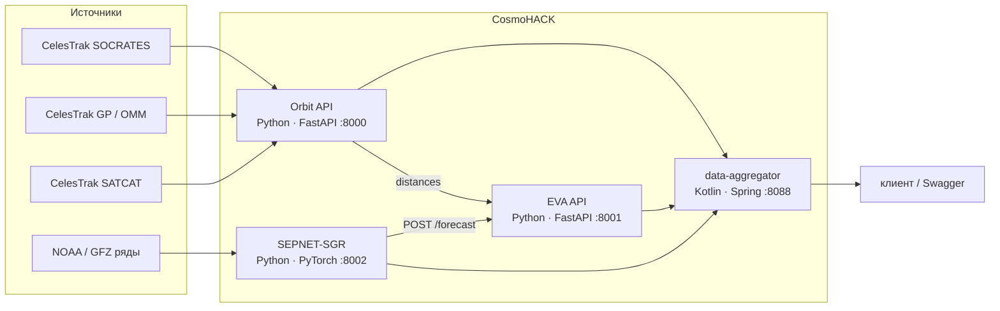

# CosmoHACK

Планирование внекорабельной деятельности на МКС.

> Исследовательский прототип. Не является эксплуатационным допуском к выходу в открытый космос.


---

## Описание решения

Выход в открытый космос нельзя назначить «на глазок»: на том же витке станция проходит мимо каталожных объектов, а радиационная обстановка меняется за часы. CosmoHACK собирает эти два контура в один ответ — **какие интервалы ближайших суток лучше подходят для ВКД**.

**Орбиты.** Кандидаты сближения МКС приходят из CelesTrak SOCRATES. Элементы OMM распространяются SGP4 в TEME: положения станции и объектов, дистанция до ближайшего внешнего тела, момент наибольшего сближения (TCA), минуты внутри критического порога. Объекты комплекса станции (стыковка, SATCAT) в риск не входят.

**Погода.** Модель SEPNET-SGR по 72 часам наблюдений строит 32 часа прогноза: потоки протонов, рентген, Kp и оценки шкал NOAA S / G / R. Решение о внешней работе — `eva_allowed` по порогам S1 / G1 / R1, а не по произвольному баллу.

**Окна ВКД.** Сервис ранжирования режет горизонт (до 24 ч) на слоты фиксированной длины и ставит каждому статус: `SAFE`, `CAUTION`, `REQUIRES_REVIEW` или `INSUFFICIENT_DATA`. Обломки и погода не складываются в одну «вероятность столкновения» — берётся максимум опасности, пробелы в данных не маскируются нулём.

Клиенту остаётся траектория на глобусе и тень: освещённость — условие работы, не механизм риска. Вероятность столкновения Pc, CDM и официальный допуск ЦУП в контур не входят.

Итог — прозрачный список сравнимых окон с дистанцией, коэффициентом погоды и явной причиной, почему слот безопасен или требует проверки.

---

## Архитектура



| Сервис | Порт | Роль |
| --- | ---: | --- |
| **Orbit API** (`MMOD`) | 8000 | Положения ISS и кандидатов, дистанции, TCA |
| **EVA API** (`merge_time_sections`) | 8001 | Ранжирование окон ВКД |
| **SEPNET-SGR** (`ML/api`) | 8002 | Прогноз погоды и решение `eva_allowed` |
| **data-aggregator** | 8088 | Единый HTTP-фасад `/ch/data-aggregator` |

---

## Языки и технологии

### Языки

| Язык | Где используется | Стек |
| --- | --- | --- |
| Python 3.12 | Orbit API, EVA, SEPNET-SGR | FastAPI, Uvicorn, Pydantic, httpx, NumPy, sgp4, PyTorch |
| Kotlin 2.3, Java 25 | data-aggregator | Spring Boot 4.1, springdoc-openapi, OkHttp, Jackson |

### Платформа и данные

| Слой | Технологии |
| --- | --- |
| HTTP API | FastAPI · Uvicorn · GZip · Pydantic · Spring WebMVC · springdoc |
| Орбиты | SGP4 (`sgp4` / OMM JSON) · NumPy · CelesTrak SOCRATES / GP / SATCAT |
| ML | PyTorch · SEPNET-SGR · калибровка `p_adverse` · NOAA scales |
| Инфра | Docker · Docker Compose · GitHub Actions → VPS |
| Клиентский контур | TEME → география и тень — на клиенте, см. [`trajectory.md`](trajectory.md) |

---

## API

### Orbit API — `:8000`

| Метод | Путь | Назначение |
| --- | --- | --- |
| `GET` | `/health` | Живость сервиса |
| `POST` | `/api/v1/orbits/positions` | ISS + `screened_objects`, TEME, шаг 60 с |
| `POST` | `/api/v1/conjunctions/distances` | Ближайший объект, TCA, критические интервалы |

Кандидаты: SOCRATES, экран **5 км**. Объекты комплекса МКС отсекаются по SATCAT (`ISS_ASSOCIATED`, в том числе NORAD `100057`). Кадр: **TEME**, км. Окно: не длиннее **24 ч**.

Качество: `COMPLETE` · `PARTIAL` · `NO_CANDIDATES`.

### EVA API — `:8001`

| Метод | Путь | Назначение |
| --- | --- | --- |
| `GET` | `/health` | Живость сервиса |
| `POST` | `/api/v1/eva/windows` | Топ-k окон длительности `duration_min` |

Берёт дистанции у Orbit API и прогноз у `POST /forecast`. Поле `critical_distance_km` обязательно и лежит в интервале (0, 5]. Параметр `top_k` не меньше 2.

### SEPNET-SGR — `:8002`

| Метод | Путь | Назначение |
| --- | --- | --- |
| `GET` | `/health` | Живость сервиса |
| `POST` | `/forecast` | 64 окна по 30 мин, горизонт 32 ч |

Вход: `origin` (граница получаса UTC). Выход: потоки, Kp, S/G/R, `p_adverse`, `eva_allowed`.

### Агрегатор — `:8088`

Базовый путь: `/ch/data-aggregator`

- Swagger: [`/ch/data-aggregator/swagger-ui.html`](http://localhost:8088/ch/data-aggregator/swagger-ui.html)
- Прокси: орбиты, ВКД, forecast

---

## Математика

### 1. Распространение орбиты

Элементы OMM → `Satrec`. На сетке с шагом 60 секунд:

$$
\mathbf{r}(t),\ \mathbf{v}(t)\in\mathbb{R}^{3}
\qquad\text{(TEME, км и км/с)}
$$

SGP4 на клиенте не выполняется.

### 2. Дистанция сближения

Для ISS (A) и объекта (B):

$$
d(t)=\bigl\|\mathbf{r}_{A}(t)-\mathbf{r}_{B}(t)\bigr\|
$$

Поворот TEME → ECEF ортогонален, поэтому d в ECEF совпадает. На минутной сетке берётся ближайший объект; около TCA интервал уточняется до секунд. Точка TCA попадает в ряд, даже если она не совпала с узлом 60 с.

Порог критичности `critical_distance_km` задаётся в запросе (по умолчанию 5 км, не шире экрана SOCRATES). Вероятность столкновения Pc **не** считается.

### 3. Безопасность по дистанции (EVA)

Кусочно-линейная шкала. Ниже порога — 0, от 10 км и дальше — 1:

$$
s(d)=
\begin{cases}
0, & d<d_{\mathrm{crit}}\\
\dfrac{d-d_{\mathrm{crit}}}{d_{\mathrm{far}}-d_{\mathrm{crit}}}, & d_{\mathrm{crit}}\le d<d_{\mathrm{far}}\\
1, & d\ge d_{\mathrm{far}}
\end{cases}
$$

где d_far = 10 км. Опасность обломков:

$$
\delta_{\mathrm{debris}}(t)=1-s\bigl(d(t)\bigr)
$$

Минута с ненулевым пересечением критического интервала получает δ_debris = 1, окно блокируется.

### 4. Космическая погода: шкалы S / G / R

| Шкала | Физика | Пороги уровня 1…5 |
| --- | --- | --- |
| **S** | max поток протонов ≥ 10 МэВ, pfu | 10, 10², 10³, 10⁴, 10⁵ |
| **G** | трёхчасовой Kp | 14/3, 17/3, 20/3, 23/3, 9 |
| **R** | max рентген 0.1–0.8 нм, Вт/м² | 10⁻⁵, 5·10⁻⁵, 10⁻⁴, 10⁻³, 2·10⁻³ |

Уровень — число порогов, которые величина **строго превысила** (`bisect_right`). 0 — ниже S1/G1/R1. Kp сравнивается непрерывно, без округления: Kp = 4.5 это G0.

Политика прототипа: ВКД запрещена при

$$
S\ge 1\ \lor\ G\ge 1\ \lor\ R\ge 1
$$

`p_adverse` — оценка вероятности этого события. Решение `eva_allowed` принимается **по уровням**, не по порогу вероятности.

Коэффициент безопасности окна прогноза:

$$
c_{\mathrm{eva}}=1-p_{\mathrm{adverse}},\qquad c_{\mathrm{eva}}\in[0,1]
$$

### 5. Совместное ранжирование окон ВКД

Минутная сетка горизонта. Политика погоды на минуте: 0, если `eva_allowed`, иначе 1.

$$
\delta(t)=\max\bigl(\delta_{\mathrm{debris}}(t),\ \delta_{\mathrm{weather}}^{\mathrm{policy}}(t)\bigr)
$$

| Статус | Условие |
| --- | --- |
| `INSUFFICIENT_DATA` | нет полного покрытия орбитальными данными (или прогнозом, если он используется) |
| `REQUIRES_REVIEW` | пересечение критического интервала MMOD или блок S/G/R |
| `CAUTION` | нет блока, но есть факторы внимания; **удержанный** прогноз за горизонтом 32 ч не даёт `SAFE` |
| `SAFE` | полное покрытие, нет критических секунд, `eva_allowed`, прогноз не hold-last |

Среди `SAFE` окна сортируются по меньшему `p_adverse` (затем дистанция, покрытие, время старта). Модель даёт 32 часа от `forecast_origin_utc`; вне этого интервала последнее окно **удерживается** и не подтверждает `SAFE`.

### 6. География и освещённость (клиент)

Орбитальный контур на глобусе описан в [`trajectory.md`](trajectory.md). Кратко.

**GMST** (среднее, без UT1 и EOP):

$$
\mathrm{JD}=\frac{t_{\mathrm{unix}}}{86400000}+2440587.5
$$

$$
\theta^{\circ}=\bigl(280.46061837+360.98564736629\cdot(\mathrm{JD}-2451545.0)\bigr)\bmod 360
$$

**TEME → ECEF** — поворот вокруг оси z:

$$
\begin{aligned}
x_{E}&=x\cos\theta+y\sin\theta\\
y_{E}&=-x\sin\theta+y\cos\theta\\
z_{E}&=z
\end{aligned}
$$

**Сфера** R = 6371 км (не WGS-84):

$$
r=\sqrt{x_{E}^{2}+y_{E}^{2}+z_{E}^{2}},\quad
\varphi=\arcsin(z_{E}/r),\quad
\lambda=\operatorname{atan2}(y_{E},x_{E}),\quad
h=r-R
$$

**Солнце** без эфемерид JPL:

$$
\delta=23.44^{\circ}\cdot\sin\bigl(2\pi\,(\mathrm{doy}-81)/365\bigr)
$$

$$
\lambda_{\odot}=-15^{\circ}\cdot(t_{\mathrm{UTC}}-12)\in[-180^{\circ},\ 180^{\circ}]
$$

МКС в тени при зенитном угле Солнца z > 96°. Сумерки на глобусе: z ∈ [86°, 108°].

Между узлами 60 с — линейная интерполяция широты и высоты и кратчайшая дуга по долготе. Это хорда, не кеплерова дуга.

---

## Данные

| Источник | Что даёт |
| --- | --- |
| [CelesTrak SOCRATES](https://celestrak.org/SOCRATES/) | Кандидаты сближения ISS, экран 5 км |
| [CelesTrak GP](https://celestrak.org/NORAD/elements/) | OMM / элементы для SGP4 |
| [CelesTrak SATCAT](https://celestrak.org/satcat/) | Отсев комплекса МКС |
| NOAA scales / GFZ Kp | Пороги S/G/R и геомагнитный индекс |

История модели: **72 ч** наблюдений → прогноз **32 ч** (64 × 30 мин).

---

## Запуск

Нужен Docker. Из корня `CosmoHACK/`:

```bash
docker compose up --build
```

| Что | URL |
| --- | --- |
| Агрегатор, health | http://localhost:8088/ch/data-aggregator/health |
| Агрегатор, Swagger | http://localhost:8088/ch/data-aggregator/swagger-ui.html |
| Orbit API | http://localhost:8000/docs |
| EVA API | http://localhost:8001/docs |
| Forecast | http://localhost:8002/docs |

Локально, без Compose (три терминала):

```bash
# Orbit
cd MMOD && uvicorn main:app --host 0.0.0.0 --port 8000

# EVA
cd CosmoHACK && uvicorn merge_time_sections.app:app --host 0.0.0.0 --port 8001

# Forecast (PowerShell: $env:PYTHONPATH = ".")
cd ML && PYTHONPATH=. uvicorn api.app:app --host 0.0.0.0 --port 8002
```

Пример тела `POST /api/v1/eva/windows`:

```json
{
  "start_time": "2026-09-20T03:30:00Z",
  "end_time": "2026-09-20T05:30:00Z",
  "duration_min": 30,
  "step_min": 1,
  "top_k": 5,
  "critical_distance_km": 5.0
}
```

---

## Структура репозитория

```
CosmoHACK/
├── MMOD/                   Orbit API, SOCRATES, SGP4
├── merge_time_sections/    EVA ranking
├── ML/                     SEPNET-SGR, данные, POST /forecast
├── data-aggregator/        Kotlin / Spring фасад
├── trajectory.md           методика глобуса и тени
├── docker-compose.yml
└── README.md
```

---

## Границы применимости

| Считаем | Не считаем |
| --- | --- |
| SGP4 по OMM, TEME | Клиентский SGP4, WGS-84, EGM |
| Miss distance и TCA | CDM, ковариация, Pc |
| SATCAT / ISS-associated | Полный каталог модулей станции |
| Оценки S/G/R и `eva_allowed` | Официальный допуск NOAA / ЦУП к ВКД |
| Тень по зениту на клиенте | Рефракция, DE440 |

Правило S/G/R ≥ 1 — настройка прототипа, не критерий полёта.
